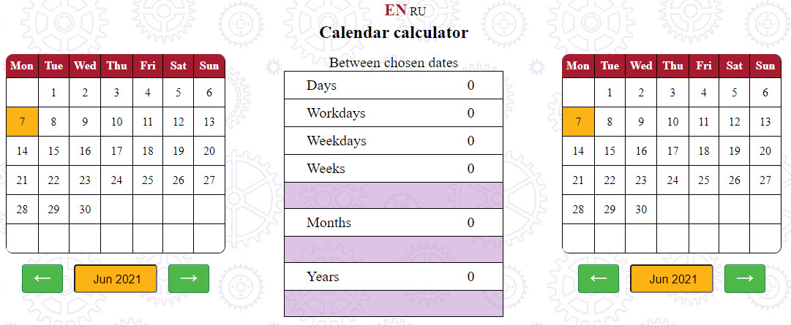
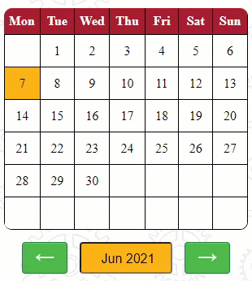
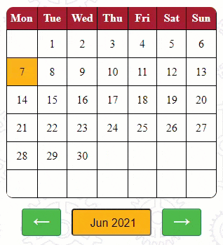
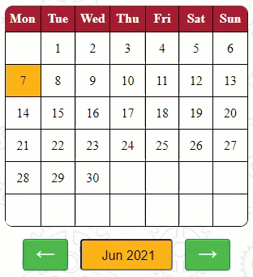
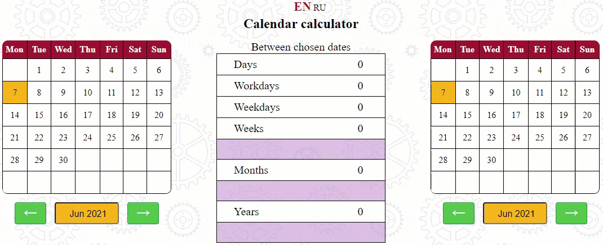
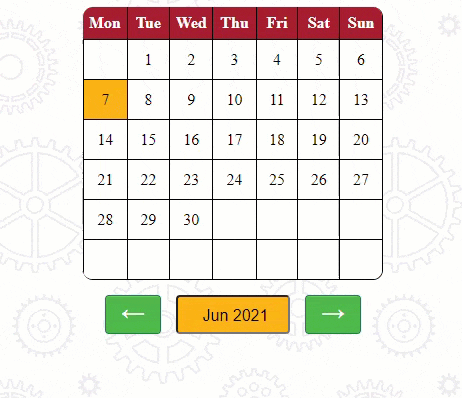
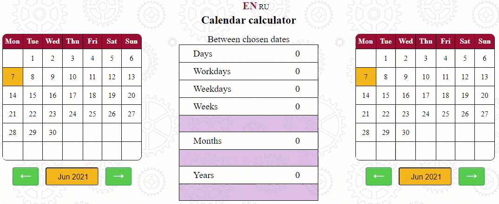
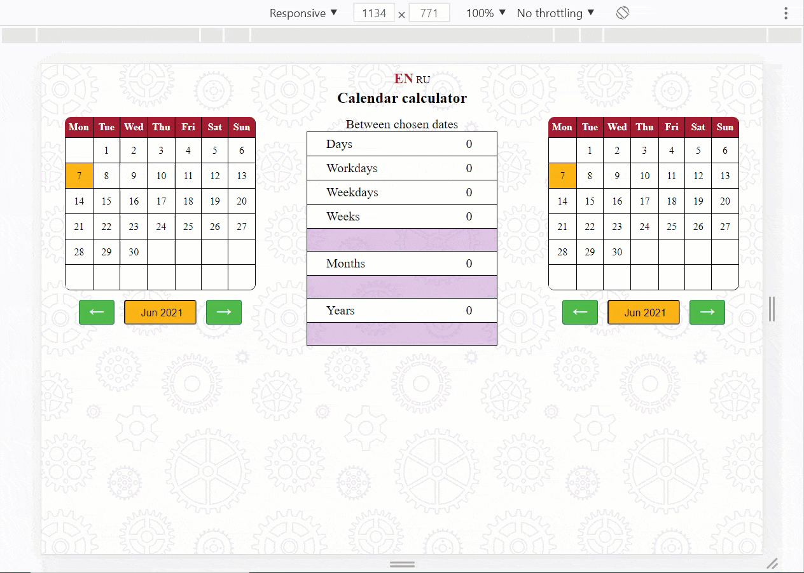

# 
Calendar сalculator

> Calendar calculator helps you calculate the difference between two dates.
> Video demo [_here_](https://youtu.be/bbaG8VNaMOA).

## Table of Contents
* [Initial state](#initial-state)
* [Input](#input)
* [Output](#output)
* [Error handling](#error-handling)
* [Security](#security)
* [Features](#features)
* [Technologies used](#technologies-used)
* [User interfaces](#user-interfaces)

## Initial state

The screen displays two calendars and the results sheet between them.

Initially, the calendars display the current month.

## Input

You can select any date by clicking on the cell with the desired date.

You can change the month forward or backward by clicking on one of the green arrow buttons.

You can also change the month and year together by entering the first three letters of the month and the four digits of the year in the orange box. The order in which these values are set and their case does not matter.

## Output

Any changes to the dates cause the results list to be updated.

Results in weeks, months, and years have remainders. That is, a remainder contains months, weeks, or days that could not be divided into weeks, months, or years. A remainder is displayed only when the result in weeks, months, or years is greater than zero.

## Errors handling

If one of the values is not set or is set incorrectly, the orange field will change color to salmon, and an error message will appear after pressing Enter. Also, if the year value is not in the range between 1970 and 2170, an error will occur. Note, the month toggle buttons stop working when the user reaches these limits.

## Security

Input fields are protected from insertion and other input methods other than keyboard keystrokes. The input fields only process the characters required to enter the month and year.

## Technologies used

- HTML5
- CSS4
- JS ES10

## Features

- The project user can choose between two languages: Russian and English. The switcher is on the top.

- The project has an adaptive interface that allows it to work on mobile screens.

## Sources

-  This project was inspired by [the days calculator](https://fincalculator.ru/kalkulyator-dnej) and  [the task](https://learn.javascript.ru/task/calendar-table) from The Modern JavaScript Tutorial book.
- The project uses the colors of the official [Harvard color palette](https://www.seas.harvard.edu/office-communications/brand-style-guide/color-palette).
- The style of the buttons was borrowed from the site [WordSmall.ru ](http://wordsmall.ru/html-i-css/primery-stili-knopok-css.html).